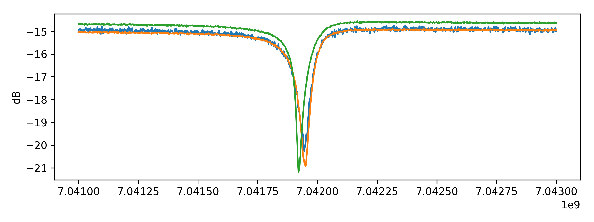
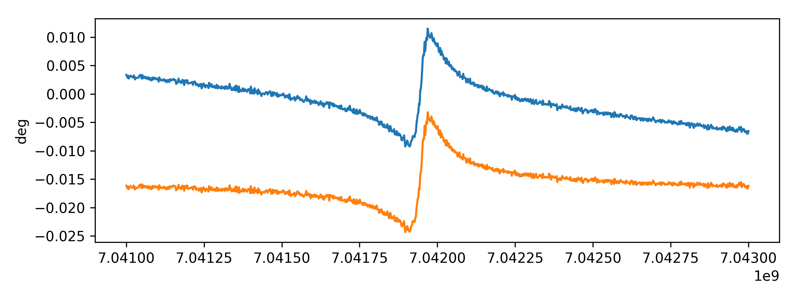
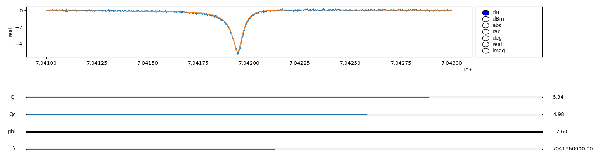
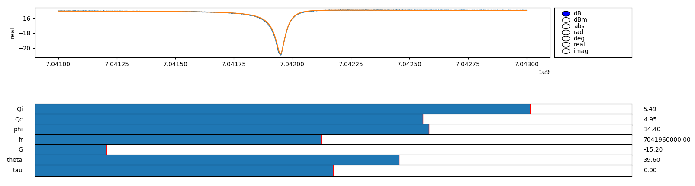

# Qutilities: Utilities for measuring Quality Factors

Qutilities is a library of analysis and measurement methods to facilitate the
measurement of superconducting resonant circuits.

The fitting of resonator models to S21 data has been largely inspired by the
methods used in [resonator_tools](https://github.com/sebastianprobst/resonator_tools).
However, I have added some of my own tricks to the processing and use
[fitkit](https://github.com/Emigon/fitkit) to exhaustively test fitting methods
across X-band frequencies.

## Fitting a Notch Resonator
To demonstrate how to use the processing pipeline I have included some real
experimental measurements of some of my own resonators, measured in transmission
at different microwave powers. We must first format them as `Signal1D` types in
order to fit them with `qutilities`:
```python
import pandas as pd

from fitkit import Signal1D

df = pd.read_pickle('examples/sample_data.pkl') # complex s21 dataset
data = [Signal1D(df[col], xraw = df.index) for col in df]

for s21 in data:
    s21.plot(style = 'dB')
```



### Removing the Line Delay
We begin by removing the line for one of the resonators. This is a slow process and
the line delay should be consistent between different measurements taken during the
same experiment.

```python
from qutilities import *

processed, line_delay_model = rm_line_delay(data[0])

data[0].plot(style = 'deg')
processed.plot(style = 'deg')
```



This is how you apply the fitted line delay to the rest of the data to remove the
line delay:
```python
data_no_line_delay = [s21/line_delay_model(s21.x) for s21 in data]
```

### Removing Global Phase and Gain
Next we must remove the global phase and gain from the measurement:
```python
res1, env1 = rm_global_gain_and_phase(data_no_line_delay[0])
res2, env2 = rm_global_gain_and_phase(data_no_line_delay[1])
res3, env3 = rm_global_gain_and_phase(data_no_line_delay[2])
```

### Fitting the Notch Resonance
Finally we can fit the resonance parameters:
```python
notch1, stds1 = fit_notch(res1)
notch2, stds2 = fit_notch(res2)
notch3, stds3 = fit_notch(res3)
```

The function `fit_notch` returns a `Parametric1D` model fitted with the resonance
parameters, and `stds`; the standard deviations for internal and coupling quality
factors.

**The quality factor parameters `Qi` and `Qc` are represented by the `log10` of
their actual value to allow for easy tuning within the gui.**

We may now inspect the fit using the `Parametric1D.gui` function:
```python
sl, rd = notch1.gui(res1.x, persistent_signals = [res1])
```



Further, we can combine all the models we've generated together to inspect the fit
including environemental factors:
```python
full_model = notch2*env2*line_delay_model
sl, rd = full_model.gui(data[1].x, persistent_signals = [data[1]])
```



### Extracting the Model Parameters
The fitted `Parametric1D` models have a parameter vector attribute `v`, which is
dictionary like. We can easily tabulate the parameters using `pandas.Series`:

```python
res2_params = {k: full_model.v[k] for k in full_model.v}
print(pd.Series(res2_params))
```

```
Qi       5.481143e+00
Qc       4.953457e+00
phi      1.394023e+01
fr       7.041959e+09
G       -1.500630e+01
theta   -1.425535e+02
tau      4.680762e-08
dtype: float64
```
